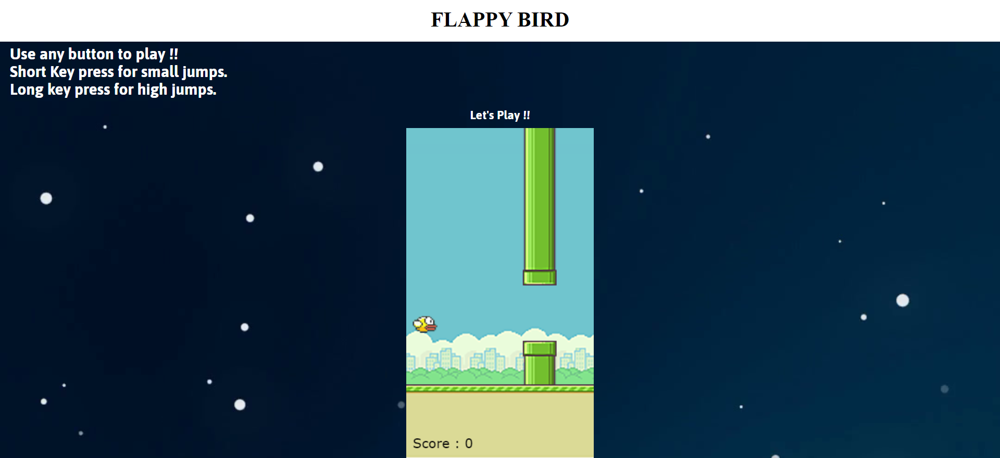

# Flappy-Bird
Flappy-Bird game is built using basic HTML,CSS and Vanilla JavaScript.
The canvas has been used from the html.
A geContext() function has been used which provides various functions for running the animations in 2d.
Different sounds and images have been added for a better view.
Scores will be updated as you play.

If you want to use this Project further follow the steps :
1. Clone this repo
2. Run the index.html file
3. Go ahead and play the game.

# A look of the game is given below

Scores will be updated as and then.

*Play and have Fun :)*
